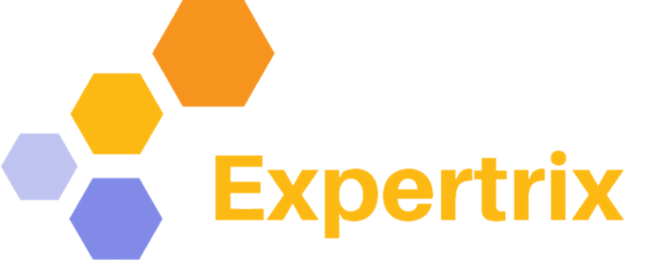

<a name="readme-top"></a>

<div align="center">


  <br/>

  <h3><b>FORM AZURE APP</b></h3>

</div>

<!-- tabla de contenido -->

# 📗 Tabla de Contenido

- [📖 Sobre el proyecto](#about-project)
  - [🛠 Construir con](#built-with)
    - [Tech Stack](#tech-stack)
    - [Key Features](#key-features)
  - [🚀 Live Demo](#live-demo)
- [💻 Como empezar](#getting-started)
  - [Setup](#setup)
  - [Prerequisitos](#prerequisites)
  - [Installar](#install)
  - [Usos](#usage)
  - [Realizar un test](#run-tests)
- [👥 Autores](#authors)
- [🔭 Futuras Funciones](#future-features)
- [🤝 Contribuidores](#contributing)
- [⭐️ Apoya nuesto proyecto](#support)
- [📝 Licencias](#license)

<!-- Descripcion de proyecto -->

# 📖 [Expertrix ] <a name="about-project"></a>

**[Expertrix]** Es un proyecto destinado para practicar y orientar a los nuevos estudiantes del sena, con manejo de distintos metodos de trabajo: como webpack, linters, babel. Para facilitar el trabajo y manejar buenas practicas de codigo, el proyecto fue construido con javascript, html, y css.

### Tech Stack <a name="tech-stack"></a>

<li> HTML </li>
<li> CSS </li>
<li> Javascript </li>
<li> Express </li>
<li> Async/await </li>
<li> Babel </li>
<li> React + Vite </li>
<li> Git </li>
<li> Github actions </li>
<li> Bash Script </li>
<!-- Funciones -->

### Key Features <a name="key-features"></a>

- **[HTML & CSS Best practices]**
- **[Responsive Design]**
- **[USER RESERVATIONS]**
- **[Express Server to handle routing]**
- **[Bash Script to automate deployment]**
- **[CI and CD Deployment with Netlify]**

<p align="right">(<a href="#readme-top">back to top</a>)</p>

<!-- LIVE DEMO -->

### 🚀 Live Demo <a name="live-demo"></a>

<!-- aqui va el github actions -->

- [Live Demo Link](	https://google.com)


<p align="right">(<a href="#readme-top">back to top</a>)</p>

<!-- Como empezar -->

## 💻 Como empezar <a name="getting-started"></a>

Para tener una copia local y correr el proyecto, Sigue estos pasos.

### Prerequisitos
para correr el proyecto, necesitas las sigiantes herramientas:
- [VS Code ]
- [Git and GitHub ]
- [Nodejs ]
- [Express ]
- [React + Vite ]
- [Bash Script ]
- [CI CD Netlify Bot  Instalation]

### Setup

Clona este repositorio a tu carpeta designada:
```sh
 cd TV-AMAZE-APP
 git clone https://github.com/Victor3spitia/Expertrix.git
```

## Install

Instala este proyecto con:

prop-types:
```sh
     npm install prop-types
```

Cors:
```sh
     npm install cors
```

axios
```sh
     npm install axios
```

mysql2
```sh
     npm install mysql2
```
React + vite
```sh
     npm install react-vite
```
React-router-dom
```sh
     npm install react-router-dom
```

Express 
```sh
     npm install express 
```

### Realizar un test

Para realizar un test, realiza el siguiente comando:

Dentro de la carpeta de backEnd tienes que escribir en la terminal Node.js command
```sh
     npm start
```

Dentro de la carpeta front tienes que escribir en otra terminal y despues puedes buscar en el 
navegador el enlace localhost:
```sh
    npm run dev
```


<p align="right">(<a href="#readme-top">back to top</a>)</p>

<!-- autores -->

## 👥 Autores <a name="authors"></a>

Victor Espitia

👤 **Autores1**

- GitHub: [@victor3spitia](https://github.com/Victor3spitia)

<p align="right">(<a href="#readme-top">back to top</a>)</p>

<!-- Futuras Funciones -->

## 🔭 Futuras Funciones <a name="future-features"></a>


- [ ] **[Recomendaciones Personalizadas]**
- [ ] **[Busqueda avanzada y Filtros]**
- [ ] **[Notificaciones y Recordatorios]**
- [ ] **[]**

<p align="right">(<a href="#readme-top">back to top</a>)</p>

<!-- CONtribuidores -->

## 🤝 Contribuidores <a name="contributing"></a>

contribuciones, problemas y solicitudes de funciones son bienvenidas!

Sientase libre de revisar: [pagina de problemas](https://github.com/alyconr/TV-AMAZE-APP.git/issues).

<p align="right">(<a href="#readme-top">back to top</a>)</p>

<!-- Soporte -->

## ⭐️ Apoya nuestro proyecto <a name="support"></a>

> Escribe un mensaje para animar a los lectores a apoyar tu proyecto

Si te gusta este proyecto, por favor, da un comienzo.

<p align="right">(<a href="#readme-top">back to top</a>)</p>


<!-- LICENSE -->

## 📝 Licencia <a name="license"></a>

This project is [MIT](/LICENSE.md) licensed.

<p align="right">(<a href="#readme-top">back to top</a>)</p>
